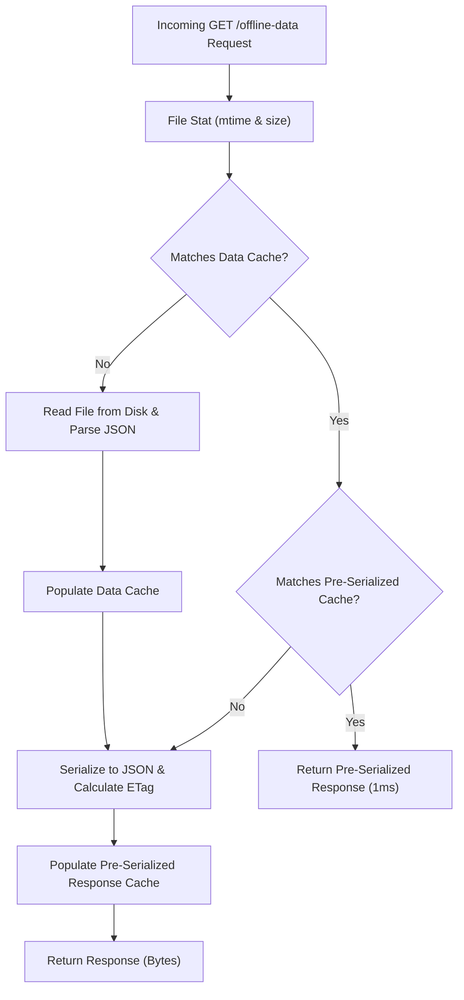

# Project EA: Comprehensive Reference Guide
## System Architecture, Data Topography, & Scoring Mechanics

This document serves as the absolute technical reference for **Project EA** (Education Academy / EA Tutorial Hub), a gamified student-teacher portal. It describes the core architectural flows, data structures, synchronisation rules, mathematical engines, and low-latency performance enhancements implemented within the codebase.

---

## 1. System Topography & Network Architecture

Project EA is engineered for hybrid environments where server PCs deploy local, offline-resilient classroom portals on local area networks (LANs), which are backed up bi-directionally by cloud replicas.

The ecosystem utilizes a **Master-Slave / Peer-to-Peer Hybrid Topology**:
- **Master Server**: The single source of truth for administrative data. It publishes authoritative states.
- **Slave Servers (Classroom PCs)**: Peer nodes that support real-time logging, run local web interfaces, and execute bidirectional pulling, merging, and syncing.
- **Cloud Mirrors**: Integrated with Supabase and public scoreboard git repositories for permanent cloud backups.

### System Topology Diagram
```mermaid
graph TD
    %% Nodes
    subgraph LAN_Classroom ["Local Classroom LAN (Offline-First)"]
        LocalPC["Local Classroom Server (Waitress / run.py)"]
        LocalLock["Single-Instance Lock (.server_main.lock)"]
        JSONLedger["JSON Ledger (offline_scoreboard_data.json)"]
        LocalDB[("Local SQLite (ea_data.db)")]
        LocalPC --> LocalLock
        LocalPC --> JSONLedger
        LocalPC --> LocalDB
    end

    subgraph Peers ["Sync Peer Network"]
        SlavePC["Slave Server Node (Classroom PC #2)"]
        SlaveJSON["JSON Ledger (Slave Roster)"]
        SlavePC --> SlaveJSON
    end

    subgraph Cloud ["Cloud Infrastructure"]
        Supabase[("Supabase Mirror Database")]
        GitRepo["Git Public Scoreboard Repository"]
    end

    %% Sync Relationships
    LocalPC <== "SSE / P2P Bidirectional Merge" ==> SlavePC
    LocalPC ==> "Git Snapshot Auto-Push" ===> GitRepo
    LocalPC ==> "JSON Payload Sync" ===> Supabase
```

---

## 2. Dual-Database Paradigm

To ensure absolute resilience against classroom LAN connectivity drops while preserving rich transactional logs for user authentication, student governance, and notebook audits, Project EA operates under a dual-database model:

1. **Relational Database (SQLAlchemy / SQLite or PostgreSQL)**: Stores structured session logins, administrative settings, student profile demographics, and weekly school/tuition notebook audits.
2. **JSON Ledger Ledger (`offline_scoreboard_data.json`)**: Acts as a flat, offline-resilient, replicated ledger containing active scoreboard rosters, point/star histories, attendance sheets, and veto transactions.

---

### A. Relational Database Schema (SQLAlchemy Models)

The following tables are defined under `app/models/` and initialized dynamically via `db.create_all()` during startup in `run.py`:

```
┌────────────────────────────────────────────────────────────────────────┐
│                              users                                     │
├────────────────────┬──────────────┬────────────────────────────────────┤
│ Field              │ Type         │ Details                            │
├────────────────────┼──────────────┼────────────────────────────────────┤
│ id                 │ Integer      │ Primary Key                        │
│ login_id           │ String(50)   │ Unique, Indexed (Case-insensitive) │
│ password_hash      │ String(255)  │ Argon2 / Werkzeug hash             │
│ role               │ String(20)   │ 'admin' | 'teacher' | 'student'    │
│ is_active          │ Boolean      │ Account status flag                │
│ first_login        │ Boolean      │ Requires pass reset on first entry │
│ created_at         │ DateTime     │ UTC account creation date          │
│ last_login         │ DateTime     │ UTC timestamp of last active entry │
│ last_login_ip      │ String(50)   │ Tracks originating access IP       │
│ password_changed_at│ DateTime     │ Tracked for security rotations     │
└────────────────────┴──────────────┴────────────────────────────────────┘
                                 │ (1:N relationship)
                                 ▼
┌────────────────────────────────────────────────────────────────────────┐
│                          activity_logs                                 │
├────────────────────┬──────────────┬────────────────────────────────────┤
│ id                 │ Integer      │ Primary Key                        │
│ user_id            │ Integer      │ Foreign Key (users.id)             │
│ action             │ String(200)  │ Verbose details of the transaction │
│ action_type        │ String(50)   │ 'login', 'upload', 'veto', etc.    │
│ ip_address         │ String(50)   │ Originating client IP address      │
│ timestamp          │ DateTime     │ UTC recorded time (Indexed)        │
└────────────────────────────────────────────────────────────────────────┘
```

#### Student Profile & Performance Metrics Tables
- **`student_profiles`**: Holds extensive demographic data (name components, school, group, roll number, contact, guardian, blood group, Aadhar, and extended profile JSON data).
- **`student_points`**: Logs transactional records of point adjustments.
- **`student_leaderboard`**: Holds pre-aggregated monthly and yearly ranking totals.
- **`monthly_points_summary`**: Holds monthly summaries stored as key-value JSON records.

```
┌────────────────────────────────────────────────────────────────────────┐
│                        student_profiles                                │
├────────────────────┬──────────────┬────────────────────────────────────┤
│ id                 │ Integer      │ Primary Key                        │
│ user_id            │ Integer      │ Foreign Key (users.id, Nullable)   │
│ roll_number        │ String(20)   │ Unique (Format: 'EA24A01')         │
│ full_name          │ String(300)  │ Combined first, second, third name │
│ class_name         │ String(20)   │ Student academic grade class       │
│ group              │ String(5)    │ 'A', 'B', 'C', etc.                │
│ profile_data       │ JSON         │ Dynamic properties and metadata    │
└────────────────────┴──────────────┴────────────────────────────────────┘
                                 │ (1:N relationships)
         ┌───────────────────────┴───────────────────────┐
         ▼                                               ▼
┌──────────────────────────────────┐           ┌──────────────────────────────────┐
│          student_points          │           │       student_leaderboard        │
├─────────────────┬────────────────┤           ├─────────────────┬────────────────┤
│ id              │ Integer (PK)   │           │ id              │ Integer (PK)   │
│ student_id      │ FK (profile)   │           │ student_id      │ FK (profile)   │
│ date_recorded   │ Date           │           │ year            │ Integer        │
│ points          │ Integer (score)│           │ month           │ Integer        │
│ stars           │ Integer        │           │ total_points    │ Integer        │
│ vetos           │ Integer        │           │ rank            │ Integer        │
└──────────────────────────────────┘           └──────────────────────────────────┘
```

#### Notebook Audit & Verification Tables
Used to log weekly subject checks. Point scales are enforced under `app/models/notebook.py`:

```
┌────────────────────────────────────────────────────────────────────────┐
│                        notebook_checks                                 │
├────────────────────┬──────────────┬────────────────────────────────────┤
│ id                 │ Integer      │ Primary Key                        │
│ roll_number        │ String(30)   │ Student roll number tracker        │
│ date_checked       │ Date         │ Date of weekly submission check    │
│ notebook_type      │ String(20)   │ 'school' | 'tuition'               │
│ total_points       │ Integer      │ Aggregated score across subjects   │
└────────────────────┴──────────────┴────────────────────────────────────┘
                                 │ (1:N cascade delete-orphan)
                                 ▼
┌────────────────────────────────────────────────────────────────────────┐
│                     notebook_subject_checks                            │
├────────────────────┬──────────────┬────────────────────────────────────┤
│ id                 │ Integer      │ Primary Key                        │
│ notebook_check_id  │ Integer      │ Foreign Key (notebook_checks.id)   │
│ subject_name       │ String(100)  │ E.g. 'Mathematics', 'Science'      │
│ is_checked         │ Boolean      │ Submission verification state      │
│ grade              │ String(30)   │ Grade status ('Excellent', etc.)   │
│ points             │ Integer      │ Derived grade score                │
└────────────────────────────────────────────────────────────────────────┘
```
- **`notebook_subject_configs`**: Stores active subjects per group/class configuration.
- **`notebook_score_settings`**: Configures global boundaries with a singleton row enforcing point limits.
- **`notebook_student_exemptions`**: Marks subjects as not applicable (N/A) for individual students (Composite Unique Constraint: `(roll_number, subject_name, notebook_type)`).

#### Student Governance & Proposals Tables
Stores democracy, council messaging, point adjustments, and score balance transfers:
- **`proposals`**: Legislative entries voted on by the student body or council (Status: `'open'`, `'closed'`, `'archived'`).
- **`proposal_votes`**: Votation ledger preventing double voting via a Unique Constraint: `(proposal_id, voter_user_id)`.
- **`proposal_messages`**: Chat board messages linked to active proposals.
- **`student_transfers`**: Records points or star transfers between accounts. Locks transfers with `lock_until` boundaries.
- **`score_adjustment_actions`**: Logs points deductions or daily scores zeroed out by Leaders (`leader_zero`) or Co-Leaders (`co_leader_reduce`).

---

### B. Flat JSON Ledger Structure (`offline_scoreboard_data.json`)

The public interface, gamified scoreboard, and synchronization pipelines read and write to the JSON file. The JSON schema structure is organized as follows:

```json
{
  "server_version": 124,
  "server_updated_at": "2026-05-21T11:49:00Z",
  "students": [
    {
      "id": 1,
      "roll": "EA24A01",
      "name": "Jane Doe",
      "class": 10,
      "group": "A",
      "active": true,
      "stars": 15,
      "veto_count": 2,
      "role_veto_count": 1,
      "used_veto_count": 0,
      "class_updated_at": "2026-05-20T14:30:00Z",
      "active_from_month": "2026-01",
      "deactivation_month": null
    }
  ],
  "scores": [
    {
      "id": 4810,
      "studentId": 1,
      "date": "2026-05-21",
      "month": "2026-05",
      "points": 95,
      "stars": 2,
      "vetos": 0,
      "star_usage_normal": 1,
      "star_usage_disciplinary": 0,
      "notes": "Completed weekly project assignments",
      "updated_at": "2026-05-21T11:00:00Z"
    }
  ],
  "attendance": [],
  "appeals": [],
  "roll_history": [
    {
      "student_id": 1,
      "old_roll": "EA23A01",
      "new_roll": "EA24A01",
      "effective_month": "2026-01"
    }
  ],
  "veto_tracking": {
    "hardened": true,
    "students": {
      "EA24A01": {
        "name": "Jane Doe",
        "individual_vetos": 2,
        "role_vetos": 1,
        "total_vetos": 3,
        "used_vetos": 0,
        "remaining_vetos": 3,
        "last_updated": "2026-05-21T11:00:00Z"
      }
    },
    "usage_log": []
  },
  "role_veto_monthly": {
    "2026-05": {
      "1": 1
    }
  },
  "month_roster_profiles": {
    "2026-05": [
      {
        "studentId": 1,
        "roll": "EA24A01",
        "month_star_count": 15,
        "month_veto_count": 3
      }
    ]
  }
}
```

---

## 3. Peer-to-Peer Bidirectional Sync Protocol

Classroom deployments require multiple client nodes (running local slave portals) to synchronize changes with a central local server (Master). 

### Sync Execution Cycle

```
[Slave Node (Classroom PC #2)]               [Master Server (Classroom PC #1)]
            │                                             │
            ├─────────── GET /scoreboard/offline-data ───>│ (Download authoritative 
            │                                             │  JSON ledger & timestamp)
            │                                             │
            │<────────── [JSON Roster & Metadata] ────────┤
            │
    (Merge Execution)
    1. Filter out stale updates.
    2. Run Superset Merge algorithm.
    3. Run Anti-Shrink Validation.
            │
            ├─────────── POST /scoreboard/sync-state ────>│ (Broadcast merged superset
            │                                             │  back to Master node)
            │                                             │
            │<─────────── [Status: OK (200)] ─────────────┤
```

### A. The Superset Merge Engine
To prevent data loss where synchronization cycles overwrite locally-added student accounts or scores, the engine implements a **non-destructive superset merge** in `app/routes/scoreboard.py`:

```python
# Extract from app/routes/scoreboard.py: Non-destructive superset merges

def _merge_students_preserve_active(existing_students, incoming_students):
    # Builds a reference dictionary indexed by id, roll, or normalized name
    # Composes student maps ensuring active:True status is never downgraded
    # without a strictly newer class update timestamp.
    ...
```

The merge algorithms operate on four core segments:

| Merged Entity | Strategy | Key Fields / Indexing | Conflict Resolution |
| :--- | :--- | :--- | :--- |
| **Students** | Preserves active state. | `id`, `roll`, `base_name` | Keeps `active: True` unless a newer timestamp exists. Preserves visibility periods (`active_from_month`, `deactivation_month`). |
| **Scores** | Superset union. | `(studentId, date, month)` | Newer `updated_at` wins. Ties resolved by retaining the higher ID. |
| **Attendance**| Superset union. | `(studentId, date)` | Compares timestamps. Keeps higher priority values. |
| **Appeals** | Chronological merge. | `id` | Higher ID and latest modified date wins. |

---

### B. The Anti-Shrink Safe Guard
To protect against database corruption caused by partial uploads or empty payloads, the sync engine runs a safeguard check before applying updates:

```python
def _is_suspicious_student_shrink(local_data, peer_data):
    """
    Aborts merging if the incoming peer snapshot suggests a significant drop.
    Rules:
      1. Roster cannot fall below a hard minimum of 25 active students.
      2. Roster size cannot drop by 8 or more students compared to the local copy.
    """
    local_count = len([s for s in local_data.get('students', []) if s.get('active')])
    peer_count = len([s for s in peer_data.get('students', []) if s.get('active')])
    
    if peer_count < 25 and local_count >= 25:
        return True # Suspicious shrink detected
        
    if (local_count - peer_count) >= 8:
        return True # Suspicious shrink detected
        
    return False
```

---

## 4. Game Mathematics & Scoring Engine

The core scoring system is governed by pure business logic calculators (completely separated from Flask/database modules to prevent circular import loops).

### A. Star Balance Calculations
Student star counts use a monthly carry-over ledger tracked in `app/utils/score_balance.py`:

$$\text{Available Stars} = \begin{cases} 
      \max(0, \text{student.stars}) & \text{for the Current Month} \\
      \max(0, \text{Carry-in} + \text{Awards} - \text{Usage}) & \text{for Historical Months} 
   \end{cases}$$

- **`Carry-in`**: Read from the student's historical monthly profile (`__month_star_count`).
- **`Awards`**: Sum of all positive star records ($\Delta > 0$) posted during that month's scoring dates.
- **`Usage`**: Sum of absolute values of all negative star records ($\Delta < 0$) posted in that month.

---

### B. Star Usage Bonus Mechanic
Students are rewarded with point bonuses when they spend stars, provided they maintain consistent score levels.
- **Trigger**: Awarded when a student records positive normal star usage (`star_usage_normal` $>0$).
- **Rule**: If the student's aggregate daily score for that record is **$\ge -50$**, they are awarded a point bonus.
- **Point Value**: **$+100$ points per normal star spent**.
- **Exception**: Points are not awarded for disciplinary deductions (`star_usage_disciplinary`) or peer-to-peer transfers (`star_transfer_out`/`star_transfer_in`).

$$\text{Points Bonus} = 100 \times \text{Normal Star Usage} \quad (\text{if Daily Score} \ge -50)$$

---

### C. Veto Ledger System
The VETO system prevents dual-tracking bugs across multiple devices by using a hardened, single-source-of-truth sub-document (`veto_tracking` in the JSON ledger) managed by `UnifiedVetoManager`.

#### Mathematical Formulation

$$\text{Available VETOs} = \begin{cases} 
      \max(0, \text{Individual Vetos} + \text{Awards} - \text{Used} + \text{Role Veto Count}) & \text{for Current Month} \\
      \max(0, \text{Carry-in} + \text{Monthly Role Grant} + \text{Awards} - \text{Used}) & \text{for Historical Months} 
   \end{cases}$$

- **`Individual Vetos`**: Base VETOs allocated to the student profile (`veto_count`).
- **`Role Veto Count`**: Live field indicating active leadership allocations.
- **`Monthly Role Grant`**: Snapshot of leadership allowances captured for historical months under `role_veto_monthly`.
- **`Carry-in`**: VETO count carried forward from the previous month.

---

## 5. Notebook Audit & Grading Parameters

Weekly notebook audits are evaluated in SQLite and synchronized to the JSON scoreboard ledger.

### A. Grade to Point Mapping Matrix
Grades mapped during notebook reviews are evaluated according to the following point scale:

| Assigned Grade | Score Value | Operational Classification |
| :--- | :---: | :--- |
| **Excellent** | $+5$ | High Performance Reward |
| **Very Good** | $+4$ | Commendable Achievement |
| **Good** | $+3$ | Consistent Standard |
| **Fair** | $+2$ | Basic Compliance |
| **Satisfactory** | $+1$ | Minimal Passing Standard |
| **Untidy Work** | $-3$ | Academic Workmanship Penalty |
| **Incomplete** | $-5$ | Failure to Complete Syllabus |
| **Not Submitted**| $-10$| Academic Truancy Penalty |

---

### B. Notebook Score Bounds
To keep overall leaderboard calculations balanced, points are bounded using parameters defined in the singleton `NotebookScoreSettings` table:
- **Maximum Point Cap**: **$+20$ points** per audit session.
- **Minimum Point Floor**: **$-30$ points** per audit session.

$$\text{Audit Points} = \text{Clamp}\left(\sum \text{Subject Grade Points}, -30, 20\right)$$

---

### C. Exemption Rules
Students may be exempted from specific weekly subject notebook checks using rules defined in the `notebook_student_exemptions` table. Exempted subjects are excluded from point calculations, allowing the student's remaining subjects to determine their average score.

---

## 6. High-Performance Latency Optimizations

Because parsing a $4\text{MB}+$ JSON ledger file can cause up to $1\text{s}$ of latency under standard environments, the system implements two key performance enhancements:

### High-Performance Cache Flow


1. **Memory Cache (`load_json_data_cached`)**:
   Maintains a parsed dictionary in memory. It bypasses disk I/O and JSON parsing on cache hits, performing a fast `os.stat` check to verify the file's modification time (`mtime_ns`) and size.
2. **Pre-Serialized Response & ETag Cache (`get_serialized_response`)**:
   Maintains pre-serialized JSON bytes in memory alongside their ETag hashes. If a client sends a request with matching headers, the server responds with a `304 Not Modified` status, bypassing data serialization and transmission overhead.

---

## 7. System Deployment & Launch Configurations

### A. Core Environment Variables
The application's runtime behavior is configured using the following environment variables:

| Variable Name | Default Value | Recommended Value | Detailed Purpose |
| :--- | :---: | :---: | :--- |
| **`EA_MASTER_MODE`** | `1` | `1` (Master) or `0` (Slave) | Determines whether the node is the authoritative local master. |
| **`SYNC_PEERS`** | None | `http://192.168.0.x:5000` | Comma-separated list of peer URLs used for synchronization. |
| **`EA_STORAGE_ROOT`** | None | `/instance` / `/var/data` | Set this to define the location of the JSON database. |
| **`EA_USE_WAITRESS`** | `1` | `1` | Configures the production-grade Waitress WSGI server on launch. |
| **`WAITRESS_THREADS`** | `16` | `16` to `32` | Number of concurrent threads Waitress allocates for requests. |

---

### B. Process Protection & Single-Instance Locking
To protect the SQLite database and JSON ledger from file corruption caused by concurrent writes, `run.py` uses a single-instance file lock:
- On startup, the server tries to create an exclusive lock file at `.server_main.lock`.
- If the file exists, the server checks the recorded PID to verify if the process is active.
- If an active process is found, the duplicate server startup is safely aborted.
- Upon server shutdown, the lock file is released using `atexit` hooks.

---

### C. Backup & Restore Operations
`run.py` maintains rolling backup logs to protect student data against power failures or system crashes:
1. **Startup Restore Snapshots**:
   Every time the server launches, a full copy of the current JSON database is saved to `startup_restore_points/offline_scoreboard_startup_YYYYMMDD_HHMMSS.json`. The server retains the last 200 copies.
2. **Master Bootstrapping**:
   If a Slave node starts up with an empty local database, it pulls the latest JSON ledger from configured `SYNC_PEERS`, validating the payload using anti-shrink checks before applying the state.
